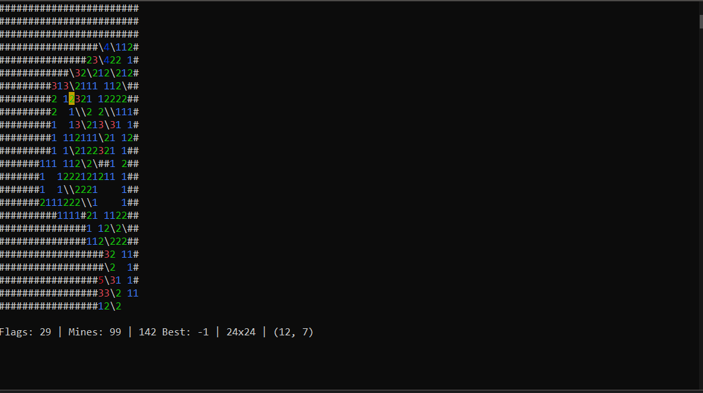
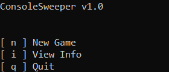

# ConsoleSweeper
A minesweeper clone - in the terminal.


Also included is a menu for easily starting new games.

Features:
```
  Custom game size
  Menus
  Highscores
  Easy navigation
```


Controls:
```
WASD - Move cursor
I - Set flag
O - Click
P - Click all unflagged neighbor tiles
```
